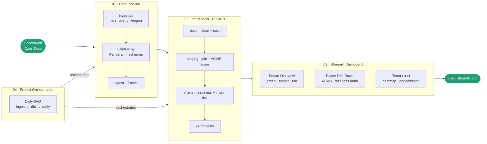

# soccer-performance-science


🚀 **[Live Dashboard](https://soccer-performance-science.streamlit.app)** — Player Readiness App

A player performance intelligence platform built on SoccerMon athlete monitoring data — modeling training load, readiness, and injury risk for elite soccer athletes.

---

## Architecture



---

## Stack

| Layer | Technology |
|---|---|
| Ingestion | Python · pandas · PyArrow |
| Validation | Pandera · pytest |
| Transformation | dbt Core · DuckDB |
| Dashboard | Streamlit · Plotly |
| Orchestration | Prefect |
| CI/CD | GitHub Actions |
| Data | SoccerMon (Zenodo · CC BY 4.0) |

---

## Project Structure

```
soccer-performance-science/
├── 01_data_pipeline/        # Python ETL — ingest, validate, test
├── 02_dbt_models/           # dbt Core — base, staging, mart layers
├── 03_streamlit_app/        # Streamlit dashboard — 3 pages
├── 04_prefect/              # Prefect orchestration — daily pipeline
└── data/
    ├── raw/                 # SoccerMon source CSVs (not committed)
    └── processed/           # Parquet outputs
```

---

## Key Insights from the Data

- **TeamA showed consistently higher ACWR spikes** than TeamB throughout the 2021 season — suggesting different periodization philosophies between the two squads
- **162 injury events across 50 players** over 2 seasons — 1.6 injuries per player per year, consistent with elite soccer benchmarks
- **Wellness scores dip the day after match days** — validating the readiness model's classification logic against real athlete behavior

---

## How to Run Locally

```bash
# 1. Clone and install
git clone https://github.com/gonzacba/soccer-performance-science.git
cd soccer-performance-science
pip install -r 01_data_pipeline/requirements.txt
pip install dbt-core dbt-duckdb streamlit plotly prefect

# 2. Download SoccerMon subjective data from Zenodo
# https://zenodo.org/records/10033832 → subjective.zip → extract to data/raw/

# 3. Run the full pipeline
python 04_prefect/flows/performance_pipeline.py

# 4. Launch the dashboard
cd 03_streamlit_app
streamlit run app.py
```

---

## Data Source

SoccerMon: A Soccer Monitoring Dataset  
Zenodo · https://zenodo.org/records/10033832  
License: CC BY 4.0
